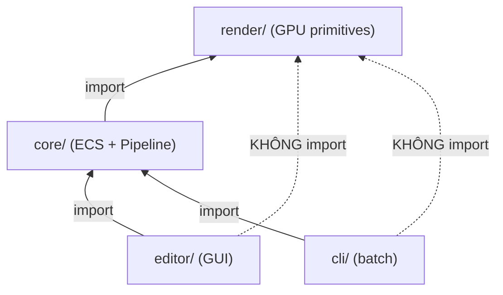

# ifol-render — System Architecture

> Thiết kế kiến trúc hệ thống render engine cho video compositing.

---

## 1. Tổng quan 3 phần

Hệ thống chia thành 3 phần độc lập, dependency **1 chiều từ dưới lên**:

```
┌─────────────────────────────────────────────────────────┐
│  Editor / CLI            (consumers — bên thứ 3)        │
│  Chỉ import core. Không biết render tồn tại.            │
├─────────────────────────────────────────────────────────┤
│  ECS Core                (trí tuệ — orchestrator)       │
│  Import render. Sở hữu data, logic, unit system.        │
│  Gọi render khi cần vẽ.                                 │
├─────────────────────────────────────────────────────────┤
│  Render Tool             (GPU thuần — passive)           │
│  Không biết ECS tồn tại. Nhận draw commands → vẽ pixel. │
└─────────────────────────────────────────────────────────┘
```

**Quy tắc vàng**: mỗi layer chỉ biết layer bên dưới nó, không bao giờ biết layer trên.

---

## 2. Render Tool (`render/`)

GPU engine thuần túy. **Không biết Entity, Component, World là gì.**

### Trách nhiệm

| Việc | Chi tiết |
|---|---|
| GPU context | Khởi tạo wgpu, chọn adapter, device, queue |
| Draw commands | Nhận danh sách `DrawCommand` (pixel coords) → render |
| Texture cache | Load texture 1 lần, tái sử dụng nhiều frame |
| Shader pipeline | Vertex + fragment shader, blend modes |
| Device check | Kiểm tra GPU capability, fallback CPU nếu cần |
| Pixel output | Readback GPU → `Vec<u8>` RGBA |

### API

```rust
pub struct DrawCommand {
    pub rect: PixelRect,       // vị trí + kích thước (pixel)
    pub rotation: f32,         // radians
    pub opacity: f32,          // 0..1
    pub source: DrawSource,    // Color | TextureId
    pub blend_mode: BlendMode,
}

pub struct GpuRenderer {
    // GPU state (private)
}

impl GpuRenderer {
    /// Khởi tạo, tự detect GPU, fallback nếu cần
    pub fn new(width: u32, height: u32) -> Result<Self, RenderError>;

    /// Load texture từ raw bytes, trả về ID. Cache nội bộ.
    pub fn load_texture(&mut self, key: &str, data: &[u8], w: u32, h: u32) -> TextureId;

    /// Kiểm tra texture đã load chưa
    pub fn has_texture(&self, key: &str) -> bool;

    /// Render 1 frame từ danh sách draw commands
    pub fn render(&mut self, commands: &[DrawCommand]) -> Vec<u8>;
}
```

### Không được làm

- ❌ Import bất kỳ type nào từ `core/`
- ❌ Biết Entity, Component, World
- ❌ Quyết định vẽ cái gì (chỉ vẽ theo lệnh)
- ❌ Quản lý thời gian, timeline

---

## 3. ECS Core (`core/`)

Trí tuệ của hệ thống. Quản lý data, logic, và **gọi render khi cần**.

### Trách nhiệm

| Việc | Chi tiết |
|---|---|
| Entity / Component / World | Cấu trúc dữ liệu ECS |
| Unit system | Hệ tọa độ (0..1 normalized), convert → pixel |
| Systems | Timeline, animation, transform resolve |
| Pipeline | Orchestrate: resolve → build draw commands → gọi render |
| Commands | Undo/redo, serialize, decouple mutation |
| Asset registry | Map file path → asset ID (data only, không load GPU) |
| Scene I/O | Serialize/deserialize scene JSON |

### Unit System (0..1 Normalized)

```
Position: [0.0, 0.0] = góc trái trên
          [1.0, 1.0] = góc phải dưới
          [0.5, 0.5] = tâm canvas

Scale:    [1.0, 1.0] = full canvas
          [0.5, 0.5] = nửa canvas
          [0.25, 0.25] = 1/4 canvas

→ Core convert: unit × resolution = pixel
  position [0.5, 0.3] × [1920, 1080] = pixel [960, 324]
```

**Tại sao Core quản lý unit?**
- Unit = business logic, không phải GPU concern
- Cùng scene, đổi resolution → core tự tính lại pixel → render không thay đổi
- User chỉ thấy unit, không biết pixel

### Pipeline Flow

```
World + TimeState
    │
    ▼
┌─ Systems ──────────────────┐
│  1. TimelineSystem         │  → filter entities visible tại time T
│  2. AnimationSystem        │  → interpolate keyframes
│  3. TransformSystem        │  → resolve parent-child, anchors
│  4. DrawCommandBuilder     │  → convert unit → pixel, tạo DrawCommand[]
└────────────────────────────┘
    │
    ▼  DrawCommand[]
    │
┌─ Render Tool ──────────────┐
│  renderer.render(commands) │  → GPU pipeline → pixels
└────────────────────────────┘
    │
    ▼  Vec<u8> RGBA
    │
    trả về cho caller (editor/cli)
```

### Command System

```rust
pub trait Command {
    fn execute(&self, world: &mut World);
    fn undo(&self, world: &mut World);
    fn description(&self) -> &str;
}

pub struct SetProperty {
    pub entity_id: String,
    pub field: PropertyPath,
    pub old_value: Value,
    pub new_value: Value,
}

pub struct CommandHistory {
    pub undo_stack: Vec<Box<dyn Command>>,
    pub redo_stack: Vec<Box<dyn Command>>,
}
```

Editor gửi commands → core execute → undo/redo stack tự quản lý.

---

## 4. Editor (`editor/`)

**Bên thứ 3**. GUI cho người dùng edit scene. Chỉ import `core/`.

### Trách nhiệm

| Việc | Chi tiết |
|---|---|
| GUI (egui) | Viewport, entity list, properties, timeline |
| User interaction | Drag, click, input → tạo Commands |
| Viewport display | Gọi `pipeline.render_frame()` → hiển thị pixels |
| File I/O | Open/Save scene JSON (qua core API) |

### Không được làm

- ❌ Import `render/` trực tiếp
- ❌ Tạo DrawCommand
- ❌ Quản lý GPU context
- ❌ Biết shader, texture cache internal

### Flow

```
User click "move entity" →
  Editor tạo SetProperty command →
    Core execute command, update World →
      Editor gọi pipeline.render_frame(world) →
        Core resolve + build DrawCommands →
          Core gọi renderer.render(commands) →
            Render Tool vẽ GPU → pixels →
              Editor hiển thị pixels lên viewport
```

---

## 5. CLI (`cli/`)

**Bên thứ 3**. Batch render, không GUI. Chỉ import `core/`.

```
ifol-render preview scene.json -o preview.png
ifol-render export scene.json -o output.mp4 --fps 30
ifol-render info scene.json
```

---

## 6. Folder Structure

```
ifol-render/
├── render/                  ← Render Tool (GPU)
│   ├── Cargo.toml           
│   └── src/
│       ├── lib.rs           ← GpuRenderer, DrawCommand
│       ├── pipeline.rs      ← wgpu pipeline setup
│       ├── texture.rs       ← texture cache
│       ├── vertex.rs        ← quad geometry
│       └── shaders/
│           └── composite.wgsl
│
├── core/                    ← ECS Core
│   ├── Cargo.toml           ← depends on render/
│   └── src/
│       ├── lib.rs
│       ├── ecs/
│       │   ├── mod.rs       ← Entity, Components, World
│       │   ├── systems.rs   ← Timeline, Animation, Transform
│       │   └── pipeline.rs  ← orchestrate systems + call render
│       ├── commands/
│       │   ├── mod.rs       ← Command trait, CommandHistory
│       │   └── property.rs  ← SetProperty, AddEntity, etc.
│       ├── types.rs         ← Vec2, Mat4, TimeRange
│       ├── units.rs         ← Unit system, unit→pixel conversion
│       ├── color.rs         ← Color4, ColorSpace
│       ├── time.rs          ← TimeState
│       └── scene.rs         ← SceneDescription, RenderSettings
│
├── editor/                  ← Editor (GUI, third-party)
│   ├── Cargo.toml           ← depends on core/ ONLY
│   └── src/
│       ├── main.rs
│       ├── app.rs
│       └── ui/
│
├── cli/                     ← CLI (third-party)
│   ├── Cargo.toml           ← depends on core/ ONLY
│   └── src/
│       └── main.rs
│
└── docs/
    └── architecture.md      ← (file này)
```

---

## 7. Dependency Graph



**1 chiều**: `render ← core ← editor/cli`

---

## 8. Phân chia trách nhiệm

| Trách nhiệm | Render | Core | Editor/CLI |
|---|:---:|:---:|:---:|
| GPU context, shaders | ✅ | | |
| Texture cache (GPU memory) | ✅ | | |
| Device check, fallback | ✅ | | |
| Draw command execution | ✅ | | |
| Entity, Component, World | | ✅ | |
| Unit system (0..1) | | ✅ | |
| Unit → pixel conversion | | ✅ | |
| Timeline, animation systems | | ✅ | |
| Command system (undo/redo) | | ✅ | |
| Asset registry (path→ID) | | ✅ | |
| Scene serialize / deserialize | | ✅ | |
| Pipeline orchestration | | ✅ | |
| GUI, user interaction | | | ✅ |
| File dialogs | | | ✅ |
| Viewport display | | | ✅ |

---

## 9. Texture / Asset Flow

```
1. Editor: user adds image entity (path = "photo.png")
       ↓
2. Core:  asset_registry.register("photo.png") → asset_id
       ↓
3. Core:  pipeline.render_frame() 
          → check renderer.has_texture(asset_id)?
          → nếu chưa: đọc file bytes, gọi renderer.load_texture(id, bytes)
          → tạo DrawCommand { source: Texture(asset_id) }
       ↓
4. Render: dùng cached GPU texture, vẽ
       ↓
5. Frame 2, 3, 4...: texture đã cache, không load lại
```

**Load 1 lần, dùng mãi** — render tool quản lý GPU memory, core quản lý "khi nào cần load".

---

## 10. Error Handling & Device Safety

```rust
// Render Tool: tự handle GPU issues
impl GpuRenderer {
    pub fn new(w: u32, h: u32) -> Result<Self, RenderError> {
        // 1. Try Vulkan
        // 2. Try DX12  
        // 3. Try OpenGL
        // 4. Fallback CPU software rasterizer
        // 5. Err nếu không gì works
    }
}

// Core: wrap errors cho consumer
pub enum CoreError {
    RenderInit(RenderError),
    AssetNotFound(String),
    SceneParseError(String),
}

// Editor/CLI: chỉ thấy CoreError, không biết GPU detail
```
